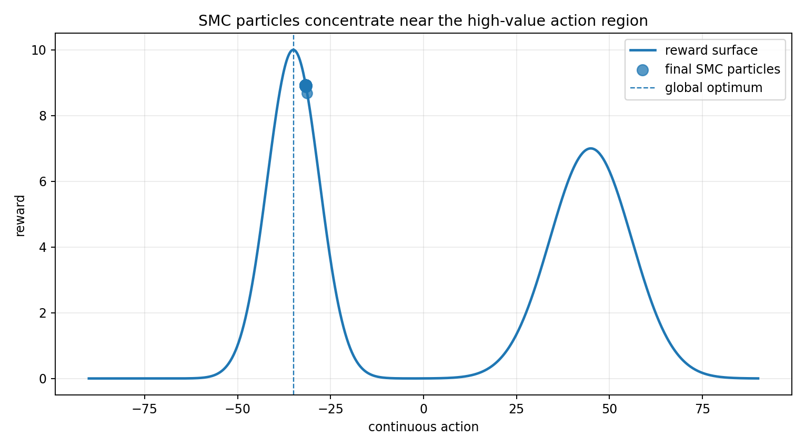
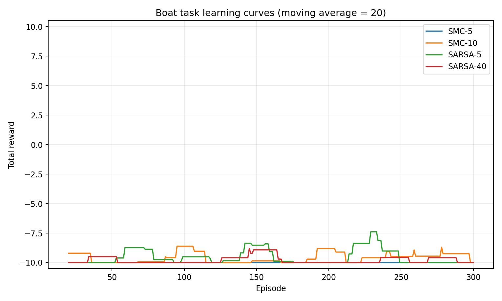
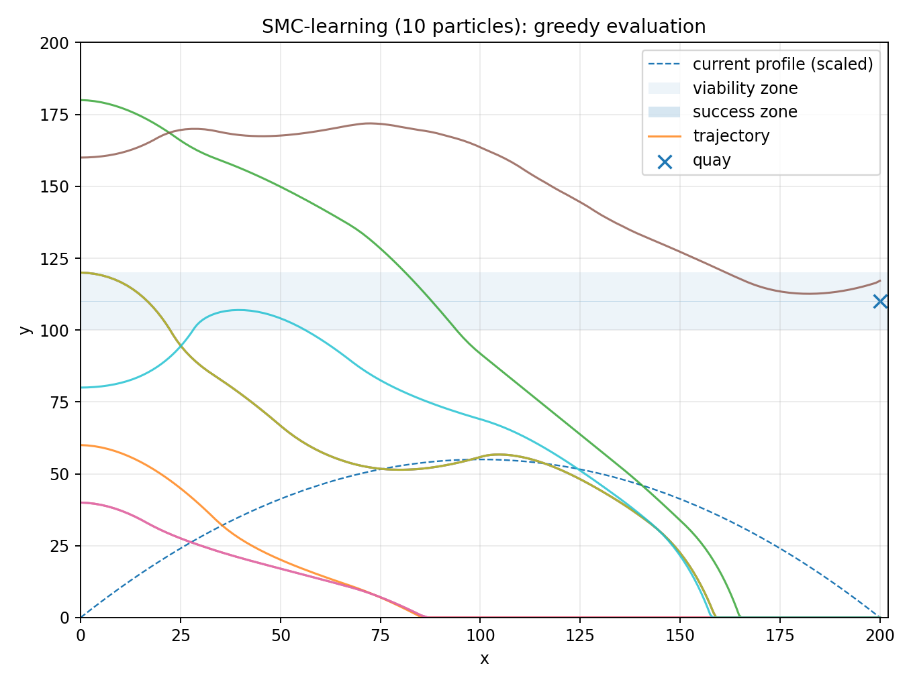
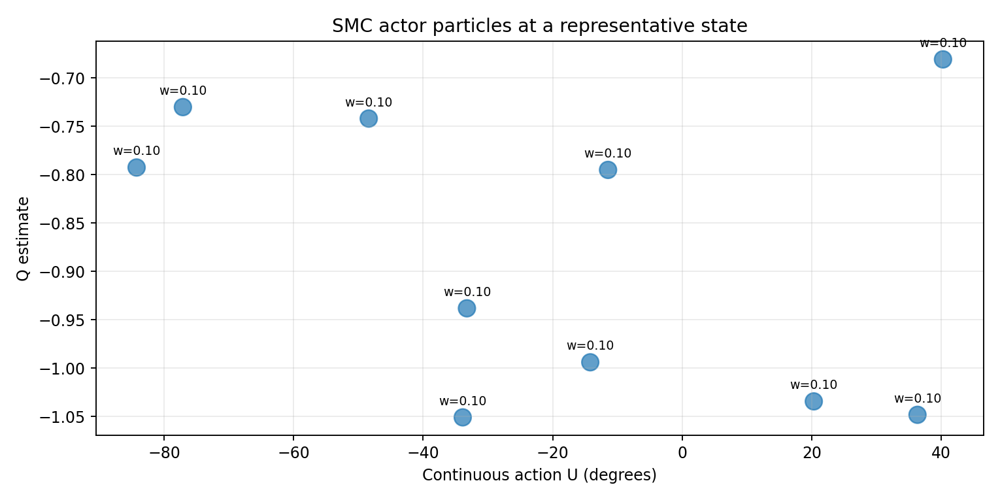

# SMC Learning in Continuous Action Spaces

A reproducible implementation of **Sequential Monte Carlo (SMC) learning** for continuous-action reinforcement learning, based on the NIPS 2007 paper *Reinforcement Learning in Continuous Action Spaces through Sequential Monte Carlo Methods* and its boat-control experiment.

This repository focuses on two ideas: visualizing how particles approximate a continuous action distribution, and comparing an SMC actor–critic agent with discrete and continuous-control baselines in the boat environment.

## What this project includes

- A continuous-action boat navigation environment.
- An SMC actor–critic agent with weighted action particles.
- SARSA with tile coding and a continuous-Q baseline.
- Compact demos for quickly checking the implementation.
- Paper-scale experiment scripts for longer, multi-seed runs.
- Tests, verification utilities, configuration files, and reproduction notes.

## Quick start

```bash
git clone https://github.com/junyuan881/smc-learning-continuous-control.git
cd smc-learning-continuous-control

python -m venv .venv
# Linux/macOS
source .venv/bin/activate
# Windows PowerShell
# .venv\Scripts\Activate.ps1

pip install -r requirements.txt
```

Run the two shortest demonstrations:

```bash
# Visualize particle evolution on a one-dimensional objective
python scripts/run_particle_demo.py

# Compare the boat-control agents with a compact training budget
python scripts/run_demo.py --episodes 500 --all-baselines
```

Generated figures and summaries are written under `results/`.

## Demo results

| Particle optimization | Boat-control learning curves |
|---|---|
|  |  |

| SMC trajectories | SMC particle distribution |
|---|---|
|  |  |

## Experiment entry points

| Goal | Command |
|---|---|
| Particle demonstration | `python scripts/run_particle_demo.py` |
| Compact boat experiment | `python scripts/run_demo.py --episodes 500` |
| Include every baseline | `python scripts/run_demo.py --episodes 500 --all-baselines` |
| Paper-scale multi-seed run | `python scripts/run_paper_scale.py --episodes 100000 --seeds 3` |
| Short paper-scale smoke test | `python scripts/run_paper_scale.py --episodes 5000 --seeds 1 --skip-slow-baselines` |
| Run tests | `pytest -q` |
| Verify project setup | `python scripts/verify_project.py` |

Use `--help` on any script to inspect the available controls for seeds, particle counts, episode budgets, output directories, and other experiment settings.

## Methods

| Method | Action representation | Purpose |
|---|---|---|
| SMC learning | Weighted particles in continuous action space | Main method reproduced in this project |
| SARSA + tile coding | Discretized features and actions | Value-based comparison baseline |
| Continuous Q-learning | Continuous action search | Continuous-control comparison baseline |

The SMC agent maintains a particle approximation to the policy, updates particle weights from observed returns, and resamples particles to concentrate computation around promising actions. The boat task then tests whether this representation can learn useful steering behavior without imposing a fixed action grid.

## Reproduction scope

The compact commands are designed for implementation checks and visualization; they are not intended to reproduce the paper's numerical results exactly. For longer experiments, use the paper-scale runner, multiple random seeds, and the supplied configuration.

- [Paper summary](docs/PAPER_SUMMARY.md)
- [Reproduction notes](docs/REPRODUCTION_NOTES.md)
- [Paper-scale configuration](configs/paper_boat.json)
- [Original paper PDF](SMC_learning_in_Continuous_Action_Spaces.pdf)

## Repository structure

```text
.
├── configs/                 # Experiment configuration
├── docs/                    # Paper summary and reproduction notes
├── notebooks/               # Interactive demonstration
├── results/demo/            # Included example outputs
├── scripts/                 # Demo, paper-scale, and verification entry points
├── src/
│   ├── agents/              # SMC, SARSA, tile coding, and continuous-Q agents
│   ├── environment.py       # Boat environment
│   ├── training.py          # Training loops
│   └── plotting.py          # Visualization utilities
└── tests/                   # Core tests
```

## Requirements

- Python 3.10+
- NumPy
- Matplotlib
- pytest

## Citation

Citation metadata is available in [`CITATION.cff`](CITATION.cff), with additional references in [`references.bib`](references.bib).

## Author

[junyuan881](https://github.com/junyuan881)

